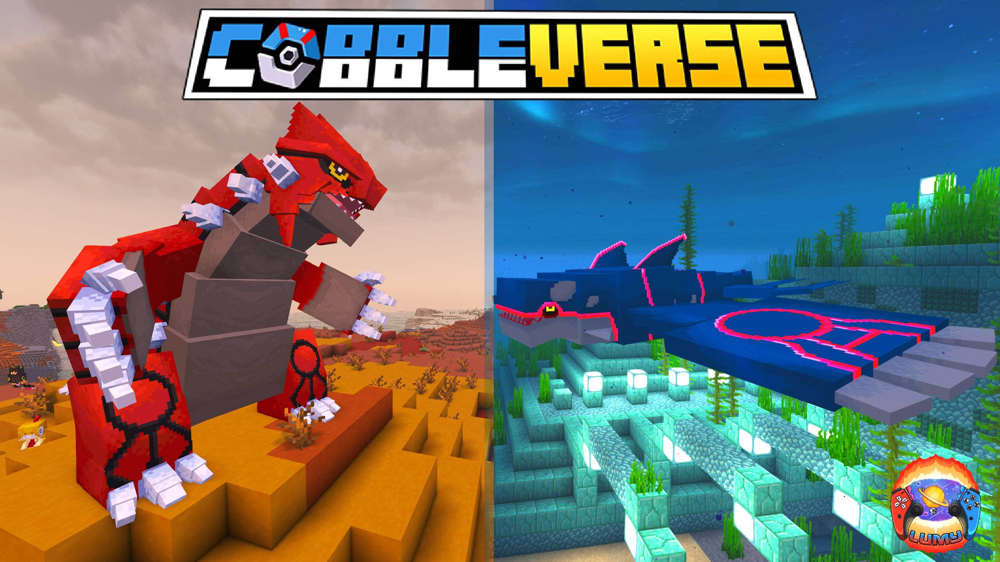

# NeoCobbleverse



Modpack personal: **Cobbleverse porteado a NeoForge** + addons + Create.
Repo privado, gestionado con **[packwiz](https://packwiz.infra.link/)** — los `.jar` NO se versionan; cada mod tiene un `.pw.toml` con URL + hash, y los compas descargan los binarios desde CurseForge/Modrinth automaticamente.

---

## Versiones base

- **Minecraft:** 1.21.1
- **Mod loader:** NeoForge 21.1.226
- **Cobblemon:** 1.7.3
- **Create:** 6.0.10 (+ Create Connected, Create Aeronautics)
- **Total:** 157 mods + 21 resourcepacks + 1 shaderpack (Complementary Unbound)

---

## Estructura del repo

```
NeoCobbleverse/
├── pack.toml                  # Manifest principal de packwiz
├── index.toml                 # Index con hashes de todos los .pw.toml
├── mods/*.pw.toml             # Metadata por mod (URL CDN + hash). SIN .jar.
├── resourcepacks/*.pw.toml    # Metadata de resourcepacks
├── *.pw.toml (raiz)           # Shaderpacks u otros (ej. complementary-unbound)
├── config/                    # Configs de mods (overrides) - SE VERSIONAN
├── options.txt                # Settings del juego - SE VERSIONAN
├── defaultconfigs/            # Configs por defecto - SE VERSIONAN
├── .packwiz/
│   ├── manifest.json          # Backup del manifest CurseForge original
│   └── build_manifest.py      # Script para regenerar manifest desde CF
├── .gitignore
└── README.md
```

Lo que NO se versiona (ver `.gitignore`): `mods/*.jar`, `resourcepacks/*.zip`, `saves/`, `logs/`, `crash-reports/`, `screenshots/`, metadata del launcher de CurseForge.

---

## Setup inicial para tus compas

### 1. Instalar el modpack

**Requisitos:**
- Java 21 (NeoForge 1.21.1 lo necesita)
- Un launcher con NeoForge: CurseForge, Prism, MultiMC, ATLauncher (recomiendo **Prism** por facilidad)

**Pasos:**

1. **Crear instance vacio** en el launcher con:
   - Minecraft `1.21.1`
   - NeoForge `21.1.226`
2. Localizar la carpeta del instance (Prism: clic derecho sobre el instance → Folder → Instance Folder; CurseForge: clic derecho → Open Folder).
3. **Clonar este repo dentro de la carpeta del instance** (puede que tu launcher use `minecraft/` o `.minecraft/` como subfolder — el clon va ahi):
   ```bash
   git clone git@github.com:jfzum/NeoCobbleverse.git .
   ```
4. **Descargar el bootstrap de packwiz** desde [github.com/packwiz/packwiz-installer-bootstrap/releases](https://github.com/packwiz/packwiz-installer-bootstrap/releases) (`packwiz-installer-bootstrap.jar`, ~10 KB). Colocarlo en la misma carpeta.
5. **Ejecutar el bootstrap** apuntando al `pack.toml` local:
   ```bash
   java -jar packwiz-installer-bootstrap.jar pack.toml
   ```
   El bootstrap descarga todos los `.jar` a `mods/`, los resourcepacks a `resourcepacks/`, verifica hashes y se acabo.
6. Arrancar el instance desde el launcher.

### 2. Actualizar el modpack (cuando jfzum suba cambios)

```bash
git pull
java -jar packwiz-installer-bootstrap.jar pack.toml
```

El bootstrap solo descarga lo que cambio.

---

## Workflow del mantenedor (jfzum)

### Instalar packwiz (una vez)

Si no tienes Go:
```bash
winget install GoLang.Go
```

Luego:
```bash
go install github.com/packwiz/packwiz@latest
```

`packwiz.exe` queda en `%USERPROFILE%\go\bin\` (asegurate que esta en PATH).

### Anadir un mod nuevo

```bash
cd C:/Users/jfzum/curseforge/minecraft/Instances/NeoCobbleverse
packwiz cf add <slug-del-mod>          # CurseForge
packwiz mr add <slug-del-mod>          # Modrinth
packwiz refresh
git add mods/<nuevo>.pw.toml index.toml pack.toml
git commit -m "add <mod>"
git push
```

### Quitar un mod

```bash
packwiz remove <nombre>
packwiz refresh
git add -A && git commit -m "remove <mod>"
git push
```

### Actualizar todos los mods a sus ultimas versiones

```bash
packwiz update --all
packwiz refresh
git add -A && git commit -m "update mods"
git push
```

### Listar lo que hay

```bash
packwiz list
```

### Re-importar desde una nueva exportacion de CurseForge

Si decides volver a generar el pack desde cero a partir de la app de CurseForge:

```bash
# 1. Exporta el profile desde CurseForge -> .zip con manifest.json
# 2. Regenera manifest.json del minecraftinstance.json actual:
python .packwiz/build_manifest.py
# 3. Re-importa (machaca los .pw.toml existentes):
packwiz curseforge import .packwiz/manifest.json -y
packwiz refresh
```

---

## Reglas para anadir mods

- Todos los mods deben ser **NeoForge 1.21.1** (Fabric solo si Sinytra Connector lo soporta).
- Addons de **Cobblemon**: solo versiones para Cobblemon **1.7.3**.
- Addons de **Create**: solo versiones para Create **6.0.x** en 1.21.1.
- **NO** instalar Embeddium, Rubidium, Oculus, Optifine, Nvidium — conflicto con Sodium/Iris.
- Anadir de uno en uno y probar antes de comitear.

---

## Conflictos conocidos / zonas calientes

- **Rendering:** pila ya cargada (Sodium + Iris + Distant Horizons + ModernFix + FerriteCore + BadOptimizations + EntityCulling + ImmediatelyFast). No tocar a la ligera.
- **Curios API:** se usa **Accessories** en su lugar via `accessories_compat_layer`. Mods que pidan Curios pueden fallar.
- **Storage:** Sophisticated Backpacks/Storage + Tom's Storage ya cubren mucho.
- **Animaciones:** NotEnoughAnimations + Crawl + BetterThirdPerson + PresenceFootsteps — cuidado con Epic Fight / Better Combat.
- **Mods con `allowModDistribution=false` en CurseForge:** parcheados con URL CDN directa en sus `.pw.toml` (ver `.packwiz/patch_restricted.py`). Si re-importas desde `manifest.json`, re-ejecutar el script para volver a aplicarlos.

---

## Server (futuro)

Cuando llegue el momento:
- El server **no necesita** mods client-only (Sodium, Iris, Distant Horizons, Xaero's, BetterF3, todos los HUD/UI/animacion).
- Carpeta `server/` aparte con su propio `pack.toml` server-only.
- Whitelist + backups automaticos del mundo en otro repo o disco.

---

## Troubleshooting

**El bootstrap falla con un mod:** comprueba que el mod tenga `allowModDistribution=true` en CurseForge. Si no, descargalo manualmente desde el link que abre el bootstrap.

**Crash al arrancar:** revisa `logs/latest.log` o `crash-reports/`. El primer culpable suele ser el ultimo mod anadido.

**Conflicto de configs tras `git pull`:** `config/` esta versionado. Si tu compa toco configs locales, tendra conflictos de merge — resuelvelos manualmente o resetea con `git checkout -- config/`.
